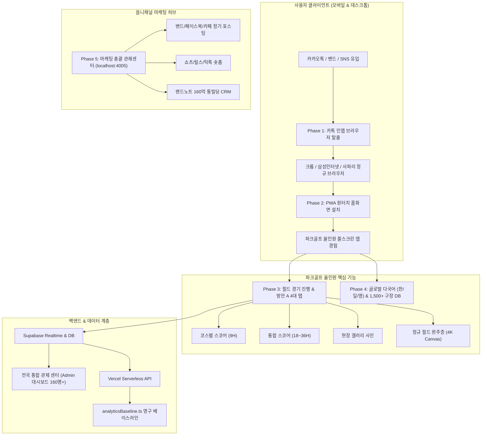

# 🏆 [마스터 프로젝트 통합 기획 및 개발 계획서]
# 파크골프 올인원 (ParkGolf All-in-One) & 랜드노트 (LandNote) 마스터 플랜

> **문서 버전**: v1.0.0 (공식 마스터 통합 계획서)  
> **총괄 마스터**: 김대희 대표님  
> **작성 및 보관 위치**: `C:\Users\Admin\.gemini\antigravity\worktrees\landnote\google_drive_docs_search\MASTER_PROJECT_PLAN.md`  
> **최종 갱신 일시**: 2026-10-04  

---

## 1. 프로젝트 비전 및 대표님 절대 원칙 지침

### 1) 서비스 개요
1. **파크골프 올인원 (ParkGolf All-in-One)**
   - 전국 400여 개 대한민국 공인 구장 및 일본 1,126개 코스 정보, 실시간 날씨, 1초 스코어링, 스마트 길안내, 전국 통합 관제 센터.
   - 공식 웹사이트: [https://www.parkgolfallinone.com](https://www.parkgolfallinone.com) (로컬 개발 포트: 3008)
   - 모바일 PWA 웹앱 & 안드로이드/iOS 홈 화면 바로가기 지원.
2. **랜드노트 (LandNote)**
   - 스마트 부동산 CRM 및 대구 수성구 범어동 160억 통빌딩 전문 매칭 플랫폼.
   - 공식 웹사이트: [https://landnote-web.vercel.app](https://landnote-web.vercel.app)

### 2) 대표님 절대 원칙 (Absolute Rules)
- **[명칭 절대 원칙]**: 과거 명칭인 '파크온'은 전면 사용을 금지하며, **무조건 '파크골프 올인원' (영문: ParkGolf All-in-One, 일문: パークゴルフ オールインワン)** 으로만 표기 및 통일합니다.
- **[배포 통제 원칙]**: 모든 코딩, UI 디자인, 로직 검증은 로컬 환경(`http://localhost:3008`)에서 100% 완료한 후, 대표님의 명시적 승인을 거쳐서만 Vercel 프로덕션에 배포합니다.
- **[데이터 실측 원칙]**: 가상 데이터나 추정치는 배제하고, 전국 160명 실측 고유 사용자 베이스라인 및 실제 필드 라운딩 팩트 데이터를 영구 보존합니다.
- **[마스코트 표준]**: 3D 디즈니/픽사 풍 1번 공식 마스코트 **'파키 (PAKI)'** 및 6컷 신문만화 룰북 규격을 준수합니다.

---

## 2. 전체 시스템 아키텍처 및 데이터 흐름

---

## 3. 핵심 5대 개발 단계별 로드맵 (Phases)

### 🚀 Phase 1: 파키 카톡 인앱 브라우저 탈출 (Kakao In-App Browser Auto Escape)
- **배경 및 필요성**:
  - 카카오톡 단톡방이나 밴드 링크로 접속하는 시니어 골퍼의 90% 이상이 카톡 내부 웹뷰(인앱 브라우저)로 열림.
  - 카톡 웹뷰 안에서는 PWA 앱 설치 이벤트(`beforeinstallprompt`)가 차단되어 홈 화면 추가가 원천적으로 불가능함.
- **핵심 목표**:
  - 사용자가 카톡 링크를 누르면, 복잡한 '점 세 개 ➔ 다른 브라우저 열기'를 찾지 않아도 **원터치 또는 자동 감지로 외부 정규 브라우저(안드로이드 크롬/삼성인터넷, 아이폰 사파리)로 즉시 탈출**.
- **구체적 실행 전략**:
  1. **안드로이드 인텐트 스킴 탈출 (Auto & 1-Click Intent)**:
     - `intent://www.parkgolfallinone.com#Intent;scheme=https;package=com.android.chrome;end` 또는 크롬/기본 브라우저 인텐트 호출.
     - 삼성 단말기 대상 삼성인터넷 호출 스킴 fallback 구비.
  2. **iOS 사파리 탈출 (Safari Universal Link / External Scheme)**:
     - 카카오톡 외부 브라우저 호출 스킴(`kakaotalk://web/openExternal?url=...` 및 `kakaoweb://openExternal?url=...`) 연동.
  3. **3D 파키 탈출 전용 스마트 안내 카드**:
     - 카톡 웹뷰 감지 즉시 상단에 3D 파키가 돋보기와 골프채를 들고 **"바깥 정규 브라우저로 1초 만에 모셔다 드릴게요!"** 고대비 황금 원터치 탈출 버튼 표출.

---

### 📲 Phase 2: PWA 원터치 홈 화면 설치 (1-Touch PWA Installation UX)
- **배경 및 필요성**:
  - 파크골프장에서 매번 URL을 입력하거나 검색해서 들어오기 번거로우므로, 어르신 폰 바탕화면에 **초록색 파키 아이콘**이 앱처럼 깔려 있어야 재방문율과 충성도가 극대화됨.
- **핵심 목표**:
  - 주소창 없이 네이티브 앱처럼 동작하는 Standalone PWA 환경을 단 1번의 터치로 설치 완료.
- **구체적 실행 전략**:
  1. **안드로이드 / 크롬 / 삼성인터넷 원클릭 설치**:
     - `beforeinstallprompt` 이벤트를 가로채어 대기 보관(`deferredPrompt`).
     - 메인 화면 상단 황금 배너 및 플로팅 FAB 버튼에 **`[ 📲 스마트폰 바탕화면에 1초 만에 깔기 ]`** 대형 버튼 상시 배치.
     - 터치 즉시 브라우저 시스템 설치 다이얼로그 즉각 트리거 ➔ 설치 성공 시 `localStorage.setItem('parkon_app_installed', 'true')` 기록 후 배너 자동 숨김.
  2. **아이폰 / 아이패드 사파리 맞춤형 2스텝 대형 그래픽 가이드**:
     - iOS 사파리는 시스템 팝업 API를 지원하지 않으므로, 화면 하단 `[ 공유(사각 화살표 ⬆️) ]` 아이콘과 `[ 홈 화면에 추가 ➕ ]` 버튼 위치를 3D 파키가 손가락으로 가리키는 고대비 2스텝 일러스트 가이드 제공.
  3. **PWA 매니페스트 및 서비스 워커(Service Worker) 최적화**:
     - 오프라인 코스 조회 캐싱 및 192x192 / 512x512 고해상도 마스코트 파키 아이콘 탑재.

---

### 🏌️‍♂️ Phase 3: 필드 경기 진행 & 스코어카드 마스터 UX (방안 A 4대 탭)
- **1) 방안 A 4대 탭 완성**:
  - **탭 1 [코스별 스코어]**: 전반/후반/9홀 단위 집중 분석 및 개별 코스 스코어카드.
  - **탭 2 [통합 스코어]**: 18홀, 27홀, 36홀 전체 종합 성적표 및 순위.
  - **탭 3 [현장 갤러리]**: 라운딩 중 찍은 동반자 사진 및 구장 풍경 보관함.
  - **탭 4 [정규 완주증]**: 3D 파키 황금 챔피언 프레임이 적용된 4K/고해상도 완주 인증서 다운로드 및 카톡/밴드 공유.
- **2) 단독 코스 삭제 vs 전체 경기 삭제 분리**:
  - 특정 코스만 체크하여 삭제할 수 있는 안전 시스템 구축.
- **3) 집단지성 2-Strike 홀 제원 검증 및 전국 심판 모드**:
  - 티박스 팻말 확인 체크박스 필수 검증 및 2개 조 교차 검증 통과 시 공식 DB 영구 승격.

---

### 🌏 Phase 4: 글로벌(한/일/영) 3개국어 다국어 및 1,500+ 구장 DB
- **대한민국 400여 개 + 일본 1,126개 NPGA 공식 구장 데이터베이스 완전 탑재**.
- 한국어 / 일본어 / 영어 원터치 전환(`LanguageContext`).
- 일본 현지 골퍼용 UI(パークゴルフ オールインワン) 및 LINE 연동.

---

### 🏢 Phase 5: 랜드노트 CRM 연동 & 옴니채널 마케팅 총괄 관제
- 대구 범어동 160억 통빌딩 전문 CRM 매칭 플랫폼(`landnote-web`) 데이터 연계.
- 마케팅 총괄 관제센터(`http://localhost:4005`):
  - 네이버 밴드 & 페이스북 그룹 자동 포스팅 (매일 오전 10:00 / 오후 15:00 정기 스케줄).
  - 유튜브 쇼츠, 인스타 릴스, 틱톡 숏폼 배포 엔진.

---

## 4. 즉시 실행 작업 명세 (Phase 1 & Phase 2 상세 작업 파일)

| 작업 영역 | 대상 파일 경로 | 작업 내용 |
| :--- | :--- | :--- |
| **카톡 탈출 엔진** | `apps/parkon/src/lib/kakaoEscape.ts` **[신규]** | 안드로이드 크롬/삼성인터넷 인텐트 스킴, iOS 사파리 외부 브라우저 스킴 자동 감지 및 강제 탈출 유틸리티 함수 구현 |
| **대문 배너 연동** | `apps/parkon/src/components/InstallPrompt.tsx` **[수정]** | 카톡 접속 시 안내문 대신 "1초 만에 바깥 브라우저로 나가기" 원터치 탈출 버튼 배치 및 원클릭 인텐트 트리거 |
| **가이드 모달 고도화** | `apps/parkon/src/components/InstallGuideModal.tsx` **[수정]** | 3D 파키가 친절히 알려주는 시니어 맞춤형 탈출 & PWA 원터치 설치 비주얼 가이드 강화 |
| **메인 홈 연동** | `apps/parkon/src/app/page.tsx` **[수정]** | 카톡 유입 감지 시 자동 탈출 로직 및 원터치 홈화면 바로가기 최상단 노출 |

---

## 5. 작업 검증 및 로컬 테스트 수칙

1. **로컬 우선 검증**:
   - `http://localhost:3008`에서 카톡 UserAgent 시뮬레이션 및 PWA `beforeinstallprompt` 이벤트 검증.
   - 콘솔 오류 0건 및 TypeScript 빌드 에러 0건 유지.
2. **배포 승인 프로토콜**:
   - 로컬 검증 완료 후 스크린샷과 함께 대표님께 보고 ➔ 대표님 승인 시 Vercel 배포 진행.
